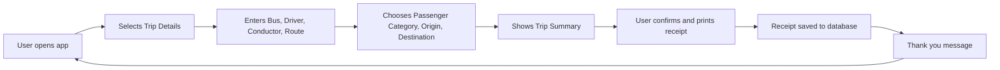

# Bus Ticketing App

<p align="center">
  
  
  
  
</p>

## Tech Stack

<p align="center">
  
  
  
  
  
  
  
  
  
</p>

This is a [**React Native**](https://reactnative.dev) project, bootstrapped using [`@react-native-community/cli`](https://github.com/react-native-community/cli).

This app has been tested on the following devices:
- [Sunmi V2s_STGL](https://www.sunmi.com/en/v2s/) (Build #3.1.9)
  - Connected to [mitsuharu's React Native Library](https://www.npmjs.com/package/@mitsuharu/react-native-sunmi-printer-library)
  - Other possible libraries include: [januslo's](https://www.npmjs.com/package/react-native-sunmi-v2-printer), [hjfruit's](https://www.npmjs.com/package/react-native-printer-sunmi)  
- SOON [Noryox NB55S](https://www.noryox.com/product/handheld-pos-terminal-2/) (Build #1.0.9_B231214.144538)
  - As of now, it seems like the API for this is proprietary

Features that possibly can be implemented further:
- NFC Integration
- Integration with better database
- Passenger dashboard
- Multi-language support
- Support for additional printer models
- Added branding to the app
- Easier user flow
- Customize company name, TIN, and address in receipt via user interface

# Getting Started (developers)

> **Note**: Make sure you have completed the [Set Up Your Environment](https://reactnative.dev/docs/set-up-your-environment) guide before proceeding.

## Step 1: Start Metro

First, you will need to run **Metro**, the JavaScript build tool for React Native.
To start the Metro dev server, run the following command from the root of your React Native project:

```sh
# Using npm
npm start

# OR using Yarn
yarn start
```

## Step 2: Build and run your app

With Metro running, open a new terminal window/pane from the root of your React Native project, and use one of the following commands to build and run your Android or iOS app:

### Android

```sh
# Using npm
npm run android

# OR using Yarn
yarn android
```

## User Flow Diagram


---

# Sample Receipt Output

Below is an example of what a printed receipt looks like (ASCII art):

```
====================================
| COMPANY NAME                     |
| 123 Main St, City, Country       |
| TIN: 123-456-789-000             |
|                                  |
| Receipt #: 000123                |
| Date: 2025-08-14                 |
| Time: 11:59:59 PM                |
| Bus Number: 2001                 |
| Driver: Juan Dela Cruz           |
| Conductor: Pedro Santos          |
| Route: Naga-Labo                 |
| From: Naga                       |
| To: Labo                         |
| Passenger: Senior Citizen        |
| Fare Amount: ₱240.00             |
====================================
|      Thank you for riding!        |
|    Have a safe and pleasant trip! |
====================================
```

You can customize the receipt layout in `src/constants/receiptLayout.ts` and related files.

# Learn More

To learn more about React Native, take a look at the following resources:

- [React Native Website](https://reactnative.dev) - learn more about React Native.
- [Getting Started](https://reactnative.dev/docs/environment-setup) - an **overview** of React Native and how setup your environment.
- [Learn the Basics](https://reactnative.dev/docs/getting-started) - a **guided tour** of the React Native **basics**.
- [Blog](https://reactnative.dev/blog) - read the latest official React Native **Blog** posts.
- [`@facebook/react-native`](https://github.com/facebook/react-native) - the Open Source; GitHub **repository** for React Native.

# Additional resources on POS machines:

- [https://xdaforums.com/t/sunmi-v2-unblock-install-fresh-os-root.4192993/page-4#post-8992457](https://xdaforums.com/t/sunmi-v2-unblock-install-fresh-os-root.4192993/page-4#post-89924577)
- [https://github.com/abdalla19977/pos_printer](https://github.com/abdalla19977/pos_printer)
- [https://pub.dev/packages/pos_printer_helper](https://pub.dev/packages/pos_printer_helper)
- [https://lynqd.com/](https://lynqd.com/)
- [https://developer.sunmi.com/docs/en-US/xeghjk491/maceghjk502](https://developer.sunmi.com/docs/en-US/xeghjk491/maceghjk502)

## CI/CD Pipeline (GitHub Actions)

Every time you push or open a pull request to the `main` branch, GitHub Actions automatically runs the following workflow:

1. **Checkout code** – Retrieves the latest code from the repository.
2. **Set up Node.js and JDK** – Prepares the environment for React Native and Android builds.
3. **Install dependencies** – Installs all required npm packages.
4. **Run tests** – Executes all unit and UI tests to ensure code quality.
5. **Build APK** – Compiles the Android app into a release APK using Gradle.
6. **Upload APK artifact** – Makes the built APK available for download as a workflow artifact.

This automated process ensures every build is tested, production-ready, and easy to share with stakeholders.

---

## License

This project is licensed under the MIT License.